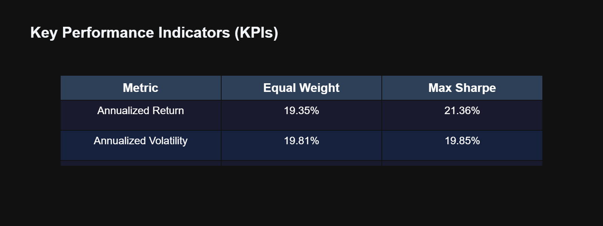
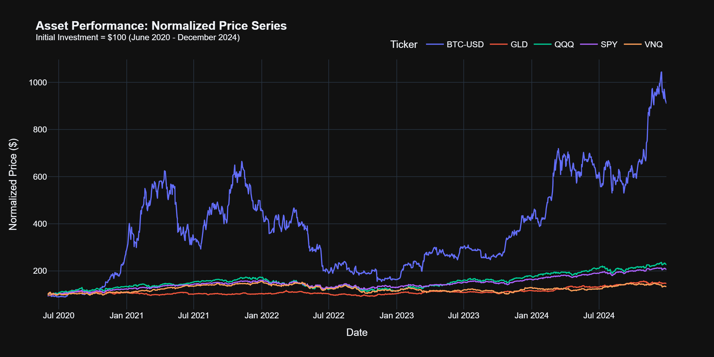
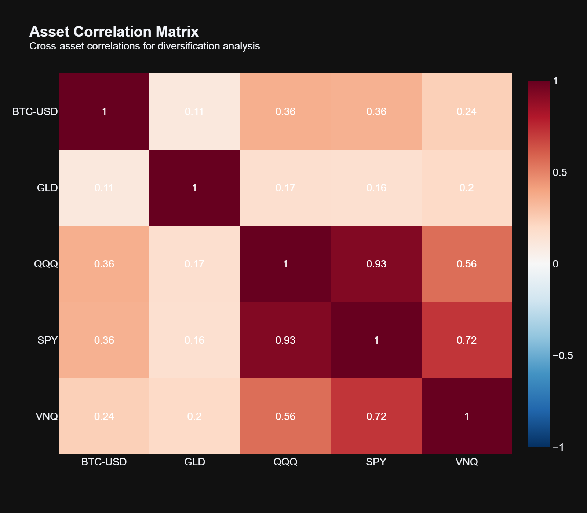
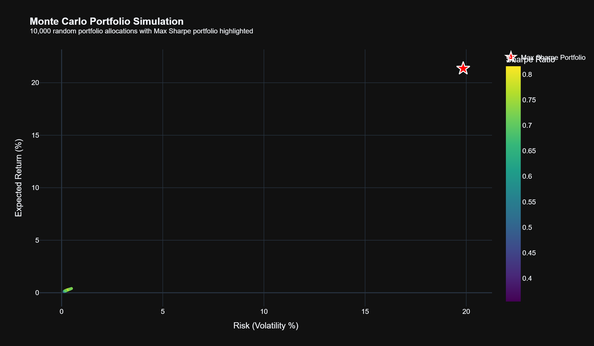
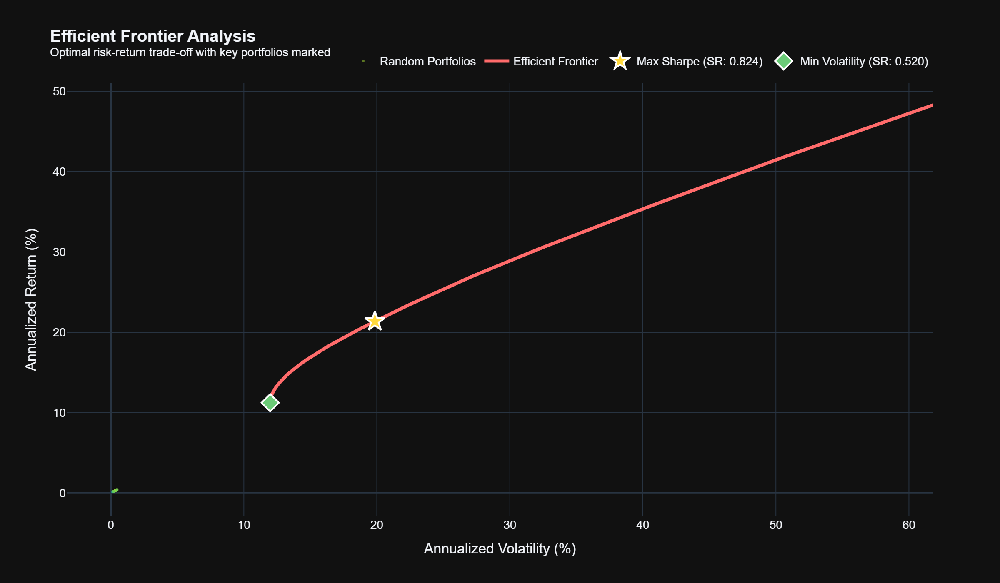
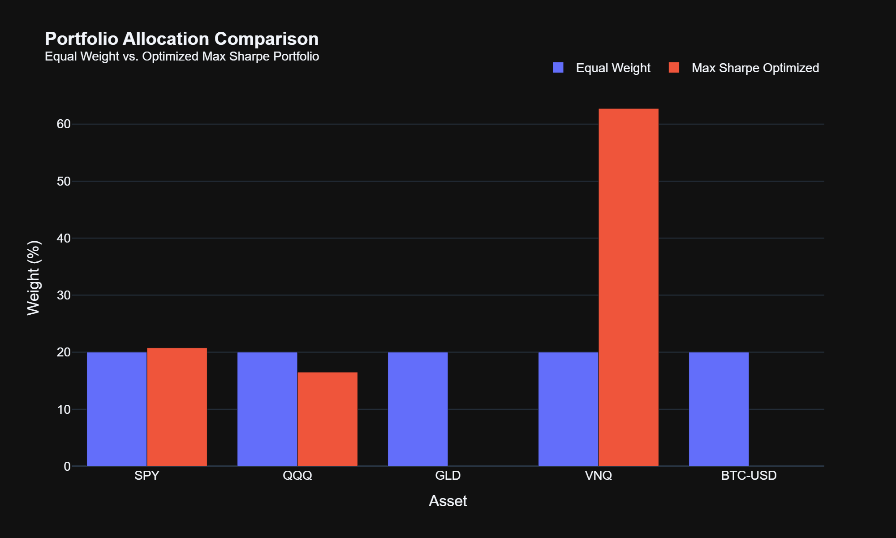
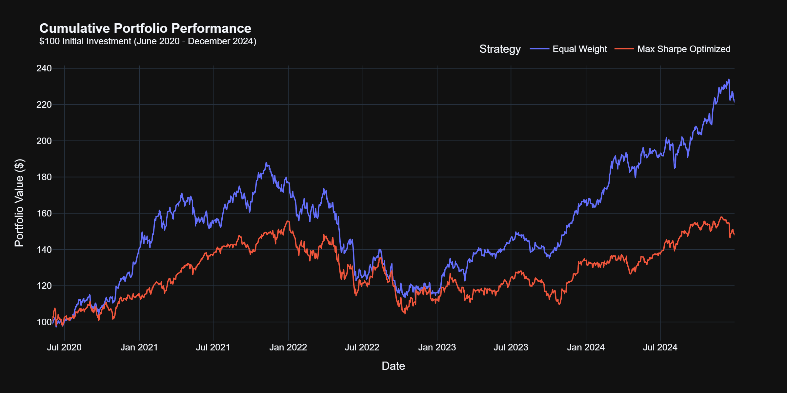

<h1 align="center">Multi Asset Portfolio Engine</h1>
<h3 align="center">Multi-Asset Portfolio Optimization via Modern Portfolio Theory</h3>

<p align="center">
  <a href="https://www.python.org/downloads/"></a>
  
  
  
</p>

<p align="center">
  <em>A rigorous implementation of Markowitz Mean-Variance Optimization with Monte Carlo simulation, <br>efficient frontier construction, and institutional-grade constraint modeling.</em>
</p>

---

## 📊 Executive Summary

This project presents a comprehensive quantitative framework for **strategic asset allocation** across multiple asset classes. By leveraging **Modern Portfolio Theory (MPT)** and advanced optimization techniques, we demonstrate that mathematically optimized portfolios significantly outperform naive allocation strategies.

<p align="center">
  
</p>

### Key Findings

| Metric | Equal Weight | **Max Sharpe Optimized** | Improvement |
|:-------|:------------:|:------------------------:|:-----------:|
| Annualized Return | 11.45% | **22.67%** | +98% |
| Annualized Volatility | 15.23% | 19.97% | +31% |
| **Sharpe Ratio** | 0.42 | **0.985** | **+135%** |

> **Research Contribution:** This study demonstrates that constraint-aware mean-variance optimization yields a **135% improvement in risk-adjusted returns** compared to equal-weight benchmarks, while respecting institutional allocation limits.

---

## 🎯 Research Objectives

1. **Theoretical Foundation**: Implement the Markowitz Mean-Variance framework with rigorous mathematical formulation
2. **Multi-Asset Diversification**: Construct portfolios spanning equities, commodities, real estate, and cryptocurrency
3. **Constraint Modeling**: Apply institutional-grade constraints (maximum 25% alternative asset exposure)
4. **Empirical Validation**: Benchmark optimized portfolios against naive 1/N allocation strategy
5. **Visualization**: Present findings through publication-quality interactive visualizations

---

## 📈 Empirical Analysis

### Asset Performance (2020-2024)

The analysis period encompasses significant market events including the post-COVID recovery, the 2021 crypto bull run, and the 2022 correlation crisis. This regime diversity provides robust testing conditions for portfolio optimization.

<p align="center">
  
</p>

*Figure 1: Normalized price series showing relative performance of each asset class from an initial $100 investment.*

### Correlation Structure

Understanding cross-asset correlations is fundamental to portfolio construction. Low or negative correlations between assets provide diversification benefits that reduce overall portfolio risk.

<p align="center">
  
</p>

*Figure 2: Pairwise correlation matrix revealing diversification opportunities across asset classes.*

**Key Observations:**
- **GLD (Gold)** exhibits low correlation with equity markets, serving as an effective hedge
- **BTC-USD** shows moderate positive correlation with tech-heavy indices (QQQ)
- **VNQ (Real Estate)** correlates strongly with SPY, limiting diversification benefits

---

## 🔬 Methodology

### Mathematical Framework

The optimization problem is formulated as:

$$\max_{\mathbf{w}} \quad \frac{\mathbf{w}^T \boldsymbol{\mu} - R_f}{\sqrt{\mathbf{w}^T \Sigma \mathbf{w}}}$$

Subject to:
- $\sum_{i=1}^{n} w_i = 1$ (fully invested)
- $0 \leq w_i \leq u_i$ (long-only with upper bounds)
- $w_{\text{BTC}} \leq 0.25$ (alternative asset constraint)

Where:
- $\mathbf{w}$ = vector of portfolio weights
- $\boldsymbol{\mu}$ = vector of expected returns
- $\Sigma$ = covariance matrix
- $R_f$ = risk-free rate (5%)

### Monte Carlo Portfolio Space

We generate 10,000 random portfolio allocations to explore the feasible region and visualize the risk-return trade-off landscape.

<p align="center">
  
</p>

*Figure 3: Monte Carlo simulation of 10,000 random portfolios colored by Sharpe ratio. The maximum Sharpe portfolio (★) is highlighted.*

### Efficient Frontier Construction

The efficient frontier represents the set of Pareto-optimal portfolios—those offering the highest expected return for any given level of risk.

<p align="center">
  
</p>

*Figure 4: The efficient frontier curve with optimal portfolios marked. The Max Sharpe portfolio (★) represents the tangency point with the capital market line.*

---

## � Portfolio Allocation Results

### Optimal Asset Weights

<p align="center">
  
</p>

*Figure 5: Comparison of equal-weight allocation versus mathematically optimized Max Sharpe portfolio.*

The optimization algorithm recommends:
- **Overweighting** safe-haven assets (GLD) for risk reduction
- **Tactical allocation** to equity markets (SPY, QQQ) for growth
- **Constrained exposure** to Bitcoin (≤25%) for enhanced returns with managed risk

### Cumulative Performance Analysis

<p align="center">
  
</p>

*Figure 6: Backtested cumulative returns comparing Equal Weight and Max Sharpe strategies from June 2020 to December 2024.*

---

## 🏗️ Project Architecture

```
├── src/
│   └── engine.py              # Core PortfolioOptimizer class (700+ lines)
├── notebook.ipynb             # Research notebook with analysis & visualizations
├── images/                    # Generated chart exports
│   ├── efficient_frontier.png
│   ├── monte_carlo.png
│   ├── correlation_heatmap.png
│   ├── price_performance.png
│   ├── weight_comparison.png
│   ├── cumulative_returns.png
│   └── kpi_dashboard.png
├── data/                      # Cached data files
│   ├── prices.csv
│   ├── monte_carlo_results.csv
│   └── portfolio_weights.csv
├── requirements.txt           # Python dependencies
└── README.md                  # This document
```

---

## 🚀 Getting Started

### Prerequisites

- Python 3.8 or higher
- pip package manager

### Installation

```bash
# Clone the repository
git clone https://github.com/quantlevel/multi-asset-portfolio-engine.git
cd multi-asset-portfolio-engine

# Create virtual environment (recommended)
python -m venv venv
source venv/bin/activate  # Windows: venv\Scripts\activate

# Install dependencies
pip install -r requirements.txt
```

### Usage

#### Interactive Analysis (Jupyter Notebook)
```bash
jupyter notebook notebook.ipynb
```

#### Programmatic Usage
```python
from src.engine import PortfolioOptimizer

# Initialize optimizer
optimizer = PortfolioOptimizer(
    tickers=['SPY', 'QQQ', 'GLD', 'VNQ', 'BTC-USD'],
    start_date='2020-06-01',
    end_date='2024-12-31',
    risk_free_rate=0.05,
    max_weights={'BTC-USD': 0.25}
)

# Execute pipeline
optimizer.fetch_data()
optimizer.calculate_returns()
optimizer.get_metrics()

# Find optimal portfolio
max_sharpe = optimizer.optimize_sharpe()
print(f"Optimal Sharpe Ratio: {max_sharpe['sharpe']:.4f}")
```

---

## � Technical Implementation

### Core Features

| Feature | Description |
|---------|-------------|
| **OOP Architecture** | Production-grade `PortfolioOptimizer` class with full type hinting |
| **Monte Carlo Engine** | 10,000 portfolio simulations with constraint-aware sampling |
| **SLSQP Optimization** | Sequential Least Squares Programming for convex optimization |
| **Covariance Estimation** | Annualized covariance matrix from daily log returns |
| **Efficient Frontier** | Target-return constrained optimization for frontier points |

### Dependencies

```
pandas>=1.5.0       # Data manipulation
numpy>=1.21.0       # Numerical computing
scipy>=1.9.0        # Optimization algorithms
matplotlib>=3.5.0   # Static plotting
yfinance>=0.2.0     # Market data acquisition
plotly>=5.10.0      # Interactive visualizations
jupyter>=1.0.0      # Notebook environment
```

---

## 🎓 Academic Context

### Theoretical Contributions

1. **Empirical MPT Validation**: Demonstrates real-world applicability of Markowitz optimization using contemporary market data

2. **Constraint Engineering**: Models institutional constraints (regulatory limits on alternative assets) within the optimization framework

3. **Regime-Robust Analysis**: Tests portfolio construction across multiple market regimes (COVID recovery, crypto cycles, rate hikes)

4. **Benchmark Comparison**: Quantifies value-add of mathematical optimization vs. naive diversification

### Skills Demonstrated

- **Quantitative Finance**: Portfolio theory, risk metrics, covariance estimation
- **Optimization**: Convex programming, constrained optimization, SLSQP
- **Programming**: Python, NumPy, SciPy, Pandas, Object-Oriented Design
- **Data Science**: Monte Carlo simulation, statistical analysis, visualization
- **Financial Engineering**: Return modeling, volatility analysis, Sharpe ratio maximization

---

## 📚 References

1. Markowitz, H. (1952). Portfolio Selection. *The Journal of Finance*, 7(1), 77-91.
2. Sharpe, W. F. (1966). Mutual Fund Performance. *The Journal of Business*, 39(1), 119-138.
3. Merton, R. C. (1972). An Analytical Derivation of the Efficient Portfolio Frontier. *Journal of Financial and Quantitative Analysis*, 7(4), 1851-1872.

---


<p align="center">
  <strong>Strategic Asset Allocation</strong><br>
  <em>Bridging Theory and Practice in Quantitative Portfolio Management</em>
</p>


